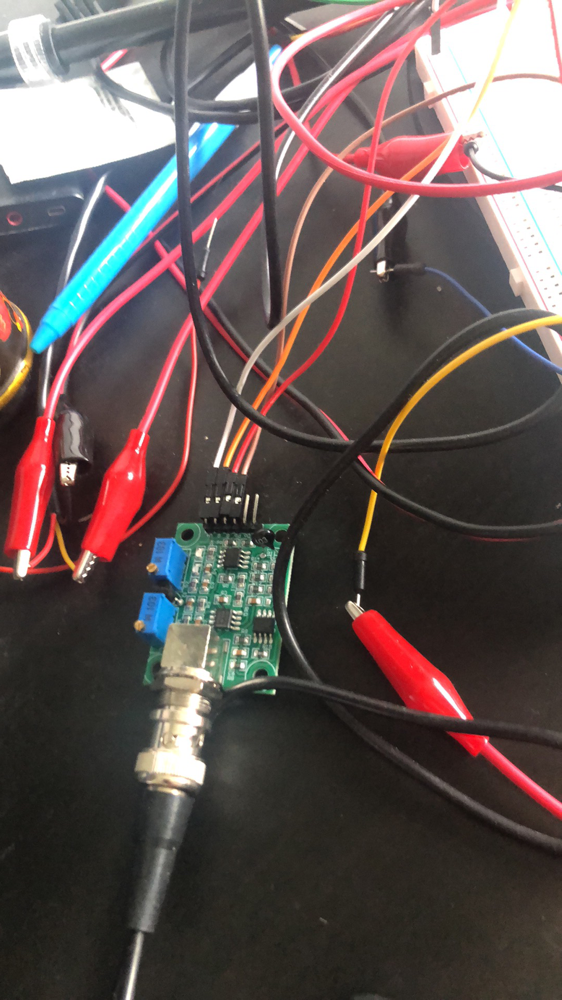
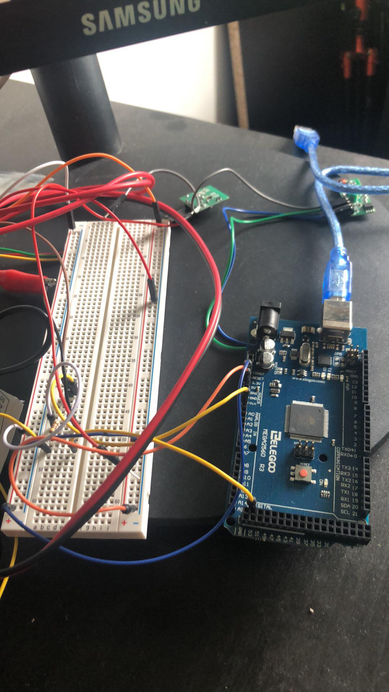
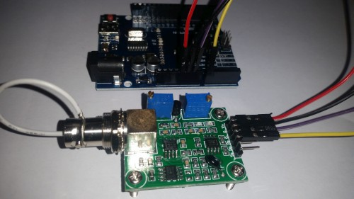
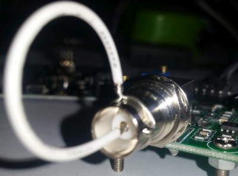
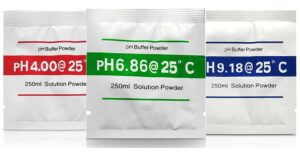
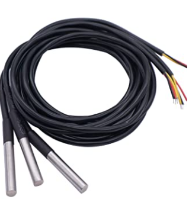

# hydroponics

[temp sensors](https://www.amazon.ca/gp/product/B087NGQFV2/ref=ppx_yo_dt_b_asin_title_o04_s00?ie=UTF8&psc=1)

[ph sensor](https://www.amazon.ca/gp/product/B07RY6SJLQ/ref=ppx_yo_dt_b_asin_title_o03_s00?ie=UTF8&psc=1)


# How to use a PH probe and sensor

If you worked with PH metering before you will know that PH values range from 0-14. Where PH 0 Will be very acidic, PH 7 will be neutral and PH 14 very alkaline. Water is near a PH 7 and this is usually around here that we will need to monitor PH of many things. A swimming pool, for example, should be slightly alkaline at 7.2, hydroponics systems around 6 (for optimum plant nutrition takeup) and aquaponics around 6.8.

I wrote this PH probe and sensor “how to” because it is not as straightforward as one would think (but quite easy when you understand the ins and outs) mostly because there is not a lot of information on this on the Internet, surely not detailed information.

We will first look at the ph probe module board and then the PH probe because both the PH probe and sensor have to be set correctly:

    - offset setting
    - limit setting
    - sketch to test the board analogue range
    - sketch for PH reading and calibration.
    - calibration of PH probe
    - PH probe usage

## The ph probe module in this tutorial is available on our site here: PH probe module BNC connector


 - PH Probe Sensor Pinout
 - TO – Temperature output
 - DO – 3.3V Output (from ph limit pot)
 - PO – PH analog output ==> Arduino A0
 - Gnd – Gnd for PH probe (can come from Arduino GND pin) ==> Arduino GND
 - Gnd  – Gnd for board (can also come from Arduino GND pin) ==> Arduino GND
 - VCC – 5V DC (can come from Arduino 5V pin) ==> Arduino 5V pin
 - POT 1 – Analog reading offset (Nearest to BNC connector)
 - POT 2 – PH limit setting

# PH probe module Offset and how to use it.

This board have the ability to supply a voltage output to the analogue board that will represent a PH value just like any other sensor that will connect to an analog pin. Ideally, we want a PH 0 represent 0v and a PH of 14 to represent 5V.

BUT there is a catch……, this board by default have PH 7 set to 0V (or near it, it differs from one PH probe to another, that is why we have to calibrate the probe as you will see later on), This means that the voltage will go into the minuses when reading acidic PH values and that cannot be read by the analog Arduino port. The offset pot is used to change this so that a PH 7 will read the expected 2.5V to the Arduino analog pin, the analog pin can read voltages between 0V and 5V hence the 2.5V that is halfway between 0V and 5V as a PH 7 is halfway between PH 0 and PH 14,

You will need to turn the offset potentiometer to get the right offset, The offset pot is the blue pot nearest to the BNC connector.

To set the offset is easy. First, you need to disconnect the probe from the circuit and short-circuit the inside of the BNC connector with the outside to simulate a neutral PH (PH7). I took a piece of wire, strip both sides, wrap the one side around the outside of the BNC connector and push the other side into the BNC hole. This short-circuit represents about a neutral PH reading of 7.

## There are two ways you can do the adjustment.

If you have a multimeter handy you can measure the value of the PO pin and adjust the offset potentiometer until  PO measures 2.5V.

I prefer to just use the sketch below. Just download it to your Arduino as you will with any other sketch, open serial monitor and view the reading there. All this sketch does is to print the volts it receives from the analog pin and print it to the serial monitor. It of course first changes the digital value to volts to make it easier. Now simply turn the offset pot until it is exactly 2.5V. You can learn more about reading voltages and digital representation of volts here: [ardiuno voltage ](https://www.arduino.cc/en/Tutorial/ReadAnalogVoltage)

# Offset sketch
```
void setup() {
 // initialize serial communication at 9600 bits per second:
 Serial.begin(9600);
}

// the loop routine runs over and over showing the voltage on A0
void loop() {
 // read the input on analog pin 0:
 int sensorValue = analogRead(A0);
 // Convert the analog reading (which goes from 0 - 1023) to a voltage (0 - 5V):
 float voltage = sensorValue * (5.0 / 1023.0);
 // print out the value you read:
 Serial.println(voltage);
 delay(300);
}
```
# PH limit setting

There is another pot that acts like a limit switch. Basically, the D0 pin on the sensor board will supply 3.3V to the pin until a preset PH value (that you set with the limit pot) is reached, at this point a red LED will light up and the pin will go down to about 0V.  I did not play with this much but suppose it can be handy if you want to activate a buzzer or something if a certain PH is reached, it will work great on an Arduino digital port – that will go high from about 2V up. This will work if the PH value goes higher than the set value. If you want it to trigger something when the PH goes lower, you need to monitor the digital pin to trigger when the digital pin goes low. You will unfortunately not be able to set this limit between two values, either if the pH goes up to high or if the PH drop to low. Programmatically you of cause can do an upper and lower limit.




## Connecting and calibrating the PH probe.

The hard part is over and this offset does not have to be set again, even if you change PH probes. We have PH probes available here: PH probe Electrode BNC connector




## Here is a couple of things to know about PH probes:

    The probes readings change over time and need to be calibrated every now and again to make sure the value is still the same and be adjusted if it did change.
    You need at least one PH buffer solution to calibration your PH probe. They are available at many different PH values, A buffer solution of 6.86 and 4.01 is most common as it covers the range of most applications. If you are only going to use one buffer solution make sure its value is near the value range you will use in your normal tests – if it is pool water a buffer solution of 6.86 is usually near enough.
    Buffers come in pre-made solutions or as a powder. I prefer the powder because it is cheaper and does not have an expiration date. The powder is easy to make up as well, I suppose it depends on the power you will use, the one I use you add the powder to 250ml distilled water and stir until all powder is dissolved. It will last about a month once you added water to it.




    A PH probe takes some time to get to the right value, allow it to be in the liquid you want to measure for at least two minutes or longer, it does not mean it will be stable at one ph value, it will jump around a bit between 3 or 4 values but on the last digit, for example,  between 6.84 – 6.88
    PH values differ in different temperatures, although that might sound cumbersome, in the temperature range between 10 – 30 degrees Celcius the PH does not differ and from 30 degrees Celcius it goes up with about a pH of 0.01 to 50 degrees Celcius that is about 0.06. In most uses, it will be below 30 degrees Celcius and temperature do not have to be calculated in.

Hook up your PH probe after you removed the wire you used to short-circuit the BNC connector and download the sketch below.

# PH measurement sketch

```
float calibration = 0.00; //change this value to calibrate
const int analogInPin = A0; 
int sensorValue = 0; 
unsigned long int avgValue; 
float b;
int buf[10],temp;
void setup() {
 Serial.begin(9600);
}
 
void loop() {
 for(int i=0;i<10;i++) 
 { 
 buf[i]=analogRead(analogInPin);
 delay(30);
 }
 for(int i=0;i<9;i++)
 {
 for(int j=i+1;j<10;j++)
 {
 if(buf[i]>buf[j])
 {
 temp=buf[i];
 buf[i]=buf[j];
 buf[j]=temp;
 }
 }
 }
 avgValue=0;
 for(int i=2;i<8;i++)
 avgValue+=buf[i];
 float pHVol=(float)avgValue*5.0/1024/6;
 float phValue = -5.70 * pHVol + calibration;
 Serial.print("sensor = ");
 Serial.println(phValue);
 
 delay(500);
}
```

A note on buffer solutions: do not CROSS CONTAMINATE! What I mean by this is to not take the probe from one buffer solution to another or from a liquid sample you tested to a buffer solution without rinsing it thoroughly with distilled water first. You will change your buffer solutions ph and your calibration will be off.

When you place the probe in the first solution you might be surprised at how far off it can be, it’s normal though. Remember to leave the probe in the solution for at least two minutes to stabilise. In the script’s top line you will see a variable called “calibration”.  Change this value to the difference between what you see in serial monitor and the buffer solutions value, for example, if you read 5.81 and the buffer solution is 6.86 you should change the variable’s value to 2.05.

## Upload the changed sketch and see how the value looks now.

# Some ideas for you.

You can add a potentiometer to your project and program that to change the calibration for you. You always run a risk that the pot might be adjusted my mistake so a button with a 5-second delay can be programmed to put the unit in calibration mode.
This becomes great if you add an LCD screen to it and if you add the calibration value in EEPROM so it holds it even if the PH project is powered off.

How about adding a buzzer to the 3.3V limit output to notify you when the PH is out of range. Usually an upper or lower will be enough, in most applications, you will either be worried about high or low PH values but not both. If this is a problem and you need the PH to be in a certain range you can easily do that programmatically and have the buzzer on a digital pin. If it is crucial you can even add a GSM module to this so you can get an SMS or how about a dosing pump to automatically get the PH back in range.

I just might, but do not hold your breath (so much to do but so little time) :-), do something like that in the future with our cheap Skeleton Duino.

## PH probe and sensor conclusion

If you go through these steps once it becomes as easy as pie. All the parts, even those I mention in the ideas section is available on our site.


# For Temp Sensor
    
   - [OneWire](https://github.com/PaulStoffregen/OneWire)
   - [Dallis Control Lib](https://github.com/milesburton/Arduino-Temperature-Control-Library)
   - [Temp Control](https://create.arduino.cc/projecthub/iotboys/how-to-use-ds18b20-water-proof-temperature-sensor-2adecc)

## click image below to watch vid
[](https://youtu.be/P0QnsXSjQ0Y)


